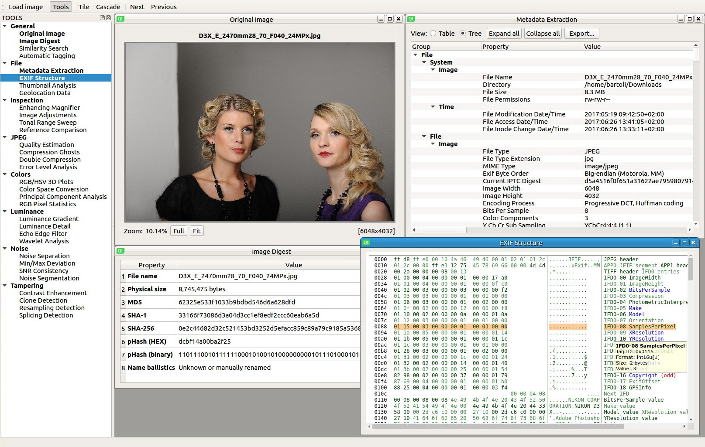
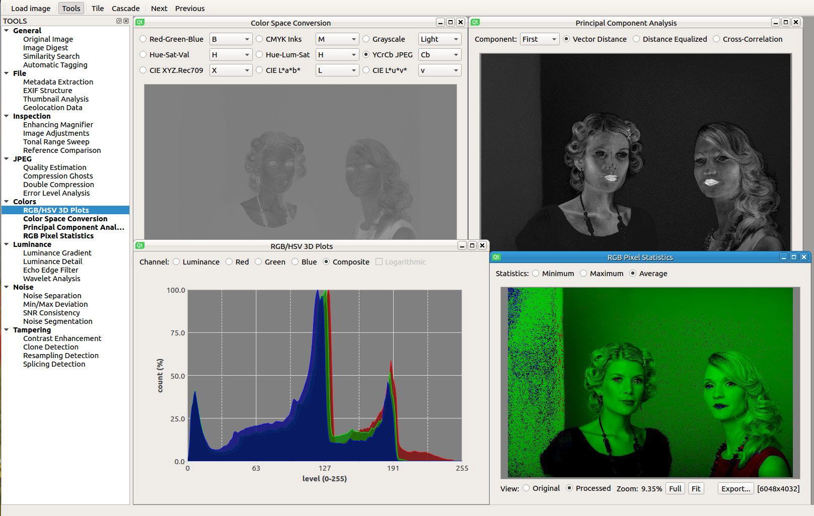
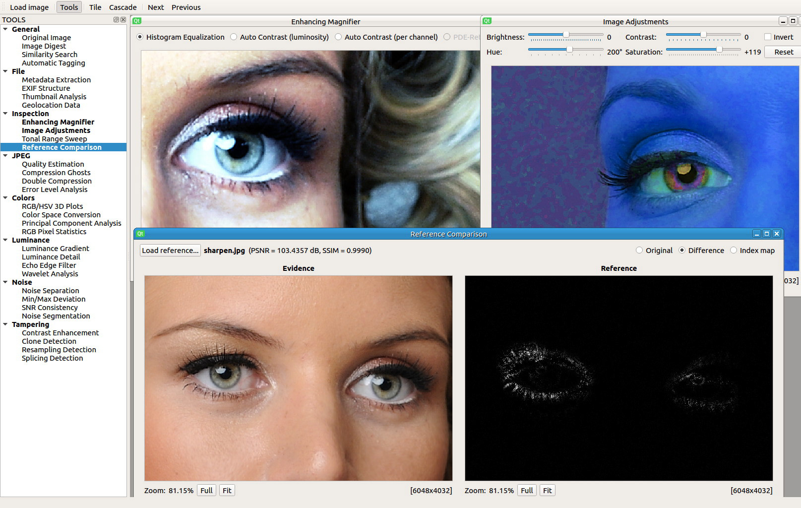
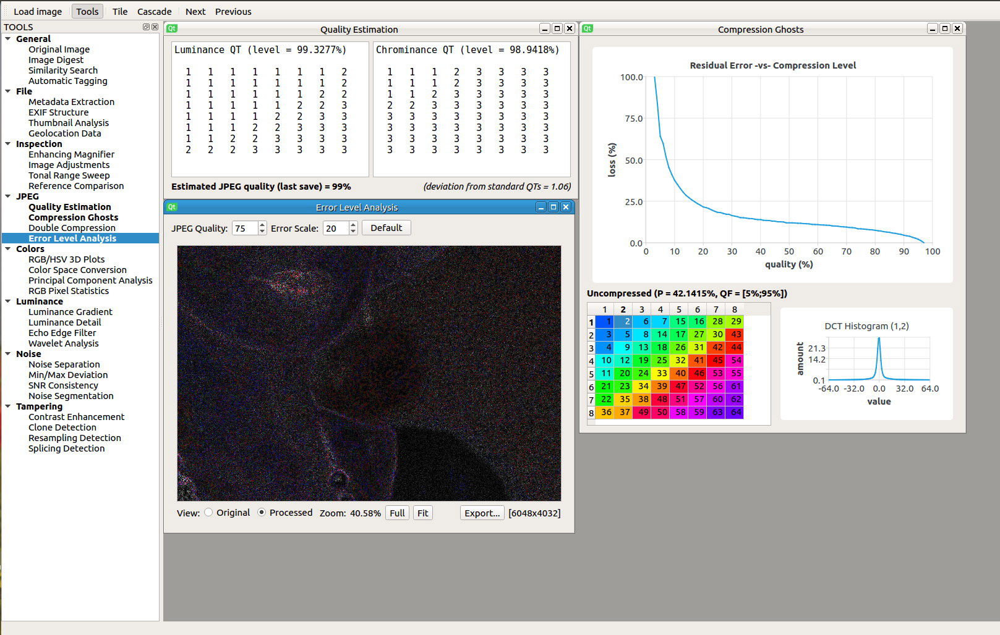

  
   <b>An open source image forensic toolset</b>

# Introduction
"*Forensic Image Analysis is the application of image science and domain expertise to interpret the content of an image and/or the image itself in legal matters. Major subdisciplines of Forensic Image Analysis with law enforcement applications include: Photogrammetry, Photographic Comparison, Content Analysis, and Image Authentication.*" (Scientific Working Group on Imaging Technologies)

**Sherloq** is a personal research project about implementing a fully integrated environment for digital image forensics. It is not meant as an automatic tool that decide if an image is forged or not (that tool probably will never exist...), but as a companion in putting at work various algorithms to discover potential image inconsistencies.

While many commercial solutions have unaffordable prices and are reserved to law enforcement and government agencies only, this toolset aims to be both a *powerful and extensible* framework providing a starting point for anyone interested in testing or developing state-of-the-art forensic algorithms.

I strongly believe that *security-by-obscurity* is the wrong way to offer any kind of security service (i.e. "Using this proprietary software I guarantee you that this photo *is* pristine... and you have to trust me!"). Instead, following the open-source mentality, everyone should be able to personally experiment various techniques, gain more knowledge and share it to the community... even better if they propose code improvements! :)

# Features
A Qt-based GUI provides highly responsive widgets for panning, zooming and inspecting images, while all image processing routines are handled by OpenCV for best efficiency. The software is based on a multi-document interface that can use floating or tabbed view for subwindows and tool outputs can be exported in various textual and graphical formats.

These are the currently planned functions [*(&ast;&ast;&ast;) = fully implemented, (&ast;&ast;) = partially implemented, (&ast;) = not yet implemented*]:

## General
- __Original Image__: display the unaltered reference image for visual inspection (&ast;&ast;&ast;)
- __Image Digest__: compute byte and perceptual hashes together with extension ballistics (&ast;&ast;)
- __Similarity Search__: use reverse search services for finding similar images on the web (&ast;)
- __Automatic Tagging__: exploit deep learning algorithms for automatic picture tagging (&ast;)

## File
- __Metadata Dump__: gather all metadata information and display security warnings (&ast;&ast;)
- __EXIF Structure__: dump the physical EXIF structure and display and interactive view (&ast;&ast;&ast;)
- __Thumbnail Analysis__: if present, extract embedded thumbnail and highlight discrepancies (&ast;&ast;&ast;)
- __Geolocation Data__: if present, get geographic data and locate them on a world map view (&ast;&ast;&ast;)

## Inspection
- __Enhancing Magnifier__: apply local visual enhancements for better identifying forgeries (&ast;&ast;&ast;)
- __Image Adjustments__: apply standard adjustments (contrast, brightness, hue, saturation, ...) (&ast;&ast;&ast;)
- __Tonal Range Sweep__: interactive tonality range compression for easier artifact detection (&ast;&ast;&ast;)
- __Reference Comparison__: synchronized double view to compare reference and evidence images (&ast;&ast;&ast;)

## JPEG
- __Quality Estimation__: extract quantization tables and estimate last saved JPEG quality (&ast;&ast;&ast;)
- __Compression Ghosts__: use error residuals to detect multiple compressions at different levels (&ast;&ast;)
- __Double Compression__: exploit First Digit Statistics to discover potential double compression (&ast;&ast;)
- __Error Level Analysis__: identify areas with different compression levels against a fixed quality (&ast;&ast;&ast;)

## Colors
- __RGB/HSV 3D Plots__: display interactive 2D and 3D plots of RGB and HSV pixel data (&ast;)
- __Color Space Conversion__: convert image into RGB/HSV/YCbCr/Lab/CMYK color spaces (&ast;&ast;&ast;)
- __Principal Component Analysis__: use PCA to project RGB values onto a different vector space (&ast;&ast;&ast;)
- __RGB Pixel Statistics__: compute minimum/maximum/average RGB values for every pixel (&ast;&ast;&ast;)

## Luminance
- __Luminance Gradient__: analyze brightness variations along X/Y axes of the image (&ast;&ast;&ast;)
- __Frequency Separation__: extract the finest details of the luminance channel (&ast;)
- __Echo Edge Filter__: use 2D Laplacian filter to reveal artificial blurred zones (&ast;&ast;&ast;)
- __Wavelet Reconstruction__: re-synthesize image varying wavelet coefficient thresholds (&ast;)

## Noise
- __Noise Extraction__: estimate and separate the natural noise component of the image (&ast;&ast;&ast;)
- __Min/Max Deviation__: highlight pixels deviating from block-based min/max statistics (&ast;&ast;&ast;)
- __SNR Consistency__: evaluate uniformity of signal-to-noise ratio across the image (&ast;&ast;&ast;)
- __Noise Segmentation__: cluster uniform noise areas for easier tampering detection (&ast;)

## Tampering
- __Contrast Enhancement__: analyze histogram inconsistencies caused by enhancements (&ast;&ast;&ast;)
- __Clone Detection__: use invariant feature descriptors for copy/rotate clone area detection (&ast;&ast;)
- __Resampling Detection__: analyze 2D pixel interpolation for detecting resampling traces (&ast;&ast;)
- __Splicing Detection__: use DCT coefficient statistics for automatic splicing zone detection (&ast;)

# Setup
The software is written in C++11 using Qt Framework for platform-independent GUI and OpenCV Library for efficient image processing. Other external depencies are [ExifTool](https://www.sno.phy.queensu.ca/~phil/exiftool/) for metadata extraction, [LIBSVM](https://www.csie.ntu.edu.tw/~cjlin/libsvm/) for forgey detection and [AlgLib](http://www.alglib.net/) for histogram manipulation.

Even if the project objective is clear, actually the software is an early prototype, so some functionalities are still missing (see list above) and it can be run only from Qt Creator under Linux. I put it on Github to track my development progress even during the alpha stage, so expect issues, bugs and installation headaches, however, if you want to take a look around, feel free to contact me if you are experiencing problems in making it run.

# Screenshots

  
   <b>File Analysis</b>: Metadata, Digest and EXIF

  
   <b>Color Analysis</b>: Space Conversion, PCA Projection, Histograms and Statistics

  
   <b>Visual Inspection</b>: Magnifier Loupe, Image Adjustments and Evidence Comparison

  
   <b>JPEG Analysis</b>: Quantization Tables, Compression Ghosts and Error Level Analysis

  
   <b>Luminance and Noise</b>: Light Gradient, Echo Edge, Min/Max Deviation and SNR Consistency

