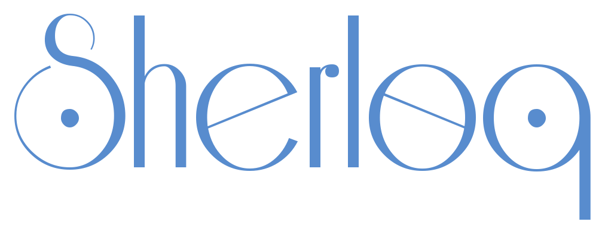
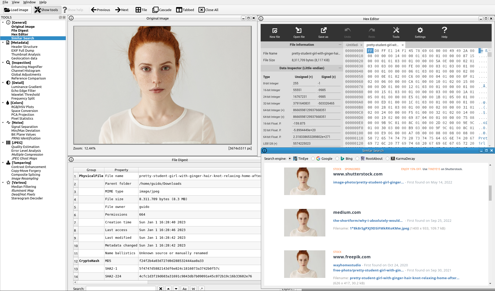
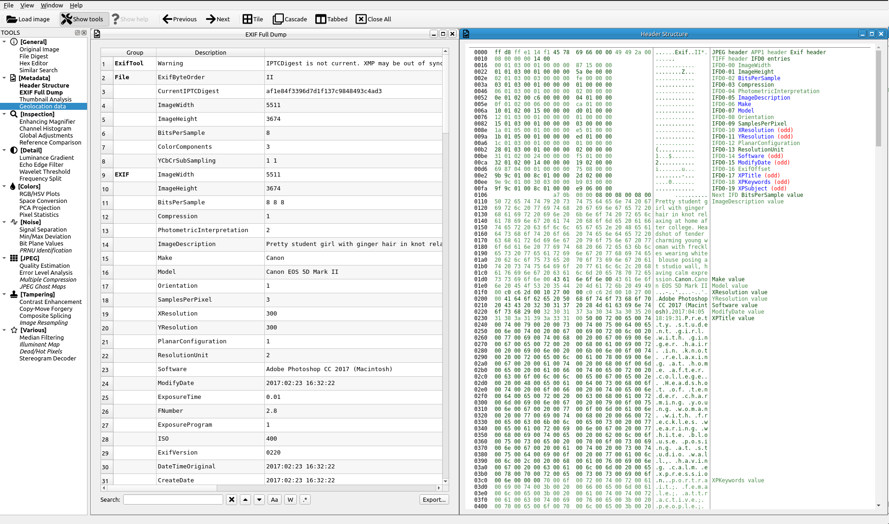
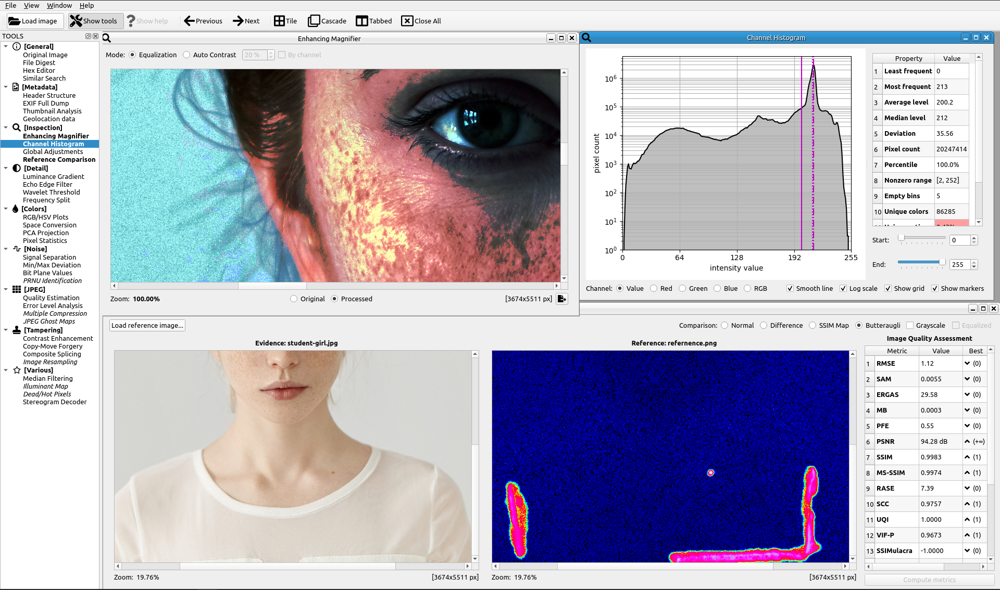
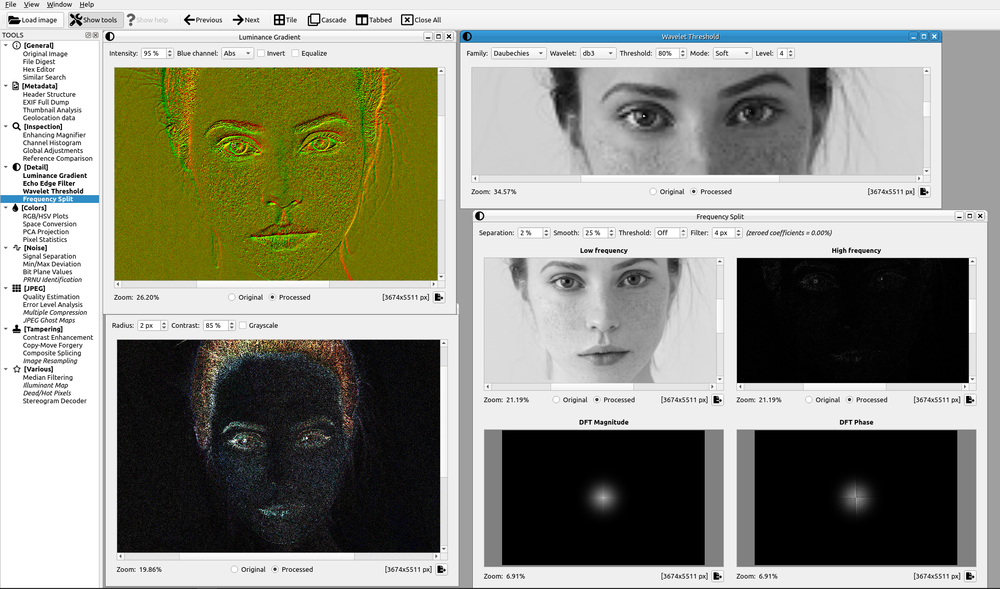
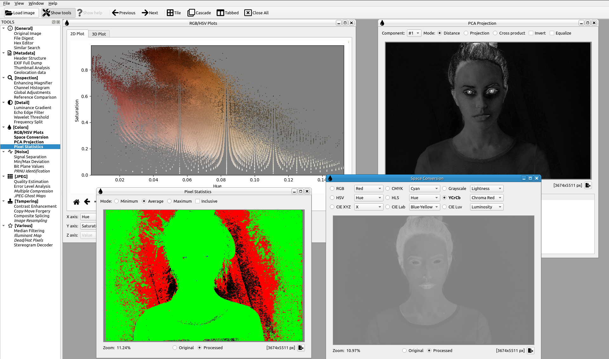
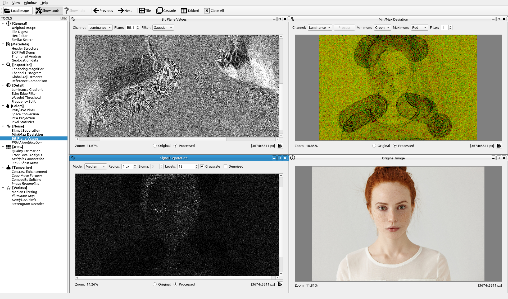
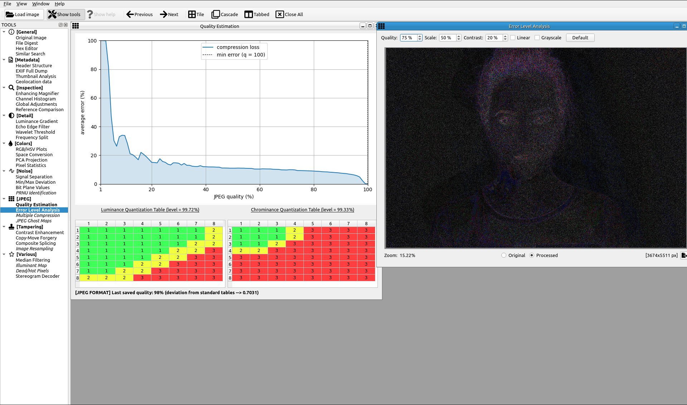
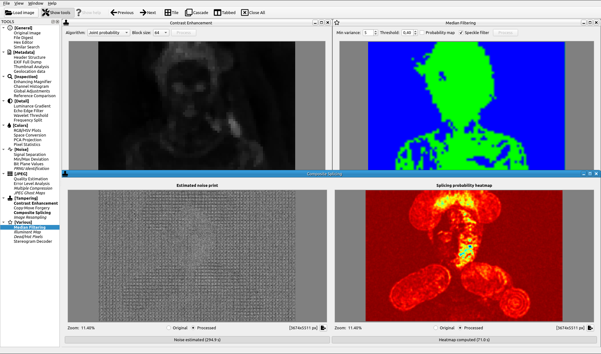

<div align="center">
  
  <br><b>An open source image forensic toolset</b>
</div>

# Introduction
"*Forensic Image Analysis is the application of image science and domain expertise to interpret the content of an image and/or the image itself in legal matters. Major subdisciplines of Forensic Image Analysis with law enforcement applications include: Photogrammetry, Photographic Comparison, Content Analysis, and Image Authentication.*" (Scientific Working Group on Imaging Technologies)
<br><br>

## This is a fork of Sherloq.

<br>
<div align="center">
  <h3>I use Sherloq with all of my <a href="https://github.com/midnit3Z0mbi3/Debian_OSINT_VM">OSINT Virtual Machine</a> builds.</h3>
  <br>
  <a href="https://github.com/midnit3Z0mbi3/Debian_OSINT_VM">
    
  </a>
 <br><br>
 <p><i>"the best sword remains in its sheath"</i></p>
</div>
<br><br>


<br>
<div align="center">
   <br>
   <h3><i>Sherloq</i> is a personal research project of <a href="https://github.com/GuidoBartoli">GuidoBartoli</a>.</h3>
   <br>
   <a href="https://github.com/GuidoBartoli">
     
   </a>  
</div>
<br><br>


This project is about implementing a fully integrated environment for digital image forensics. It is NOT 🙅 🙅 🙅  meant as an automatic tool that decide if an image is forged or not (that tool probably will never exist...), but as a companion in experimenting with various algorithms found in the latest research papers and workshops.

While many commercial solutions have high retail prices and often reserved to law enforcement and government agencies only, this toolset aims to be a both an extensible framework and a starting point for anyone interested in making experiments in this particular application of digital signal processing.

I strongly believe that *security-by-obscurity* is the wrong way to offer any kind of forensic service (i.e. "Using this proprietary software I guarantee you that this photo *is* pristine... and you have to trust me!"). Following the open-source philosophy, everyone should be able to try various techniques on their own, gain knowledge and share it to the community... even better if they contribute with code improvements! :)

- [History](https://github.com/midnit3Z0mbi3/sherloq-fork#History)
- [Features](https://github.com/midnit3Z0mbi3/sherloq-fork#Features)
- [Screenshots](https://github.com/midnit3Z0mbi3/sherloq-fork#Screenshots)
- [Installation](https://github.com/midnit3Z0mbi3/sherloq-fork#Installation)
- [Updates](https://github.com/midnit3Z0mbi3/sherloq-fork#Updates)
- [Bibliography](https://github.com/midnit3Z0mbi3/sherloq-fork#Bibliography)

# History
The first version was written in 2015 using C++11 to build a command line utility with many options, but soon it turned to be too cumbersome and not much interactive. That version could be compiled with CMake after installing OpenCV, Boost and AlgLib libraries. This first proof of concept offered about 80% of planned features (see below for the full list).

While also including novel algorithms, the 2017 version mainly added a Qt-based multi-window GUI to provide a better user experience. Multiple analyses could be shown on screen and a fast zoom/scroll  viewer was implemented for easier image navigation. That project could be compiled with Qt Creator with Qt 5 and OpenCV 3 and covered about 70% of planned features.

Fast-forward to 2020 when I decided to port everything in Python (PySide2 + Matplotlib + OpenCV) for easier development and deployment. While this iteration is just begun and I have yet to port all the previous code on the new platform, I think this will be the final "form" of the project (as long as someone does not volunteer up to develop a nice web application!).

I'm happy to share my code and get in contact with anyone interested to improve or test it, but please keep in mind that this repository is *not* intended for distributing a final product, my aim is just to publicly track development of an *unpretentious educational tool*, so expect bugs, unpolished code and missing features! ;)

# Features
This list contains the functions that the toolkit will (hopefully) provide once beta stage is reached (**NOTE:** functions displayed in _italics_ inside the program are not yet implemented!).

## Interface
- Modern Qt-based GUI with multiple tool window management
- Support for many formats (JPEG, PNG, TIFF, BMP, WebP, PGM, PFM, GIF)
- Highly responsive image viewer with real-time pan and zoom
- Many state-of-the-art algorithms to try out interactively
- Export both visual and textual results of the analysis
- Extensive online help with explanations and tutorials

## Tools

### General
- __Original Image__: display the unaltered reference image for visual inspection
- __File Digest__: retrieve physical file information, crypto and perceptual hashes
- __Hex Editor__: open an external hexadecimal editor to show and edit raw bytes
- __Similar Search__: browse online search services to find visually similar images

### Metadata
- __Header Structure__: dump the file header structure and display an interactive view
- __EXIF Full Dump__: scan through file metadata and gather all available information
- __Thumbnail Analysis__: extract optional embedded thumbnail and compare with original
- __Geolocation Data__: retrieve optional geolocation data and show it on a world map

### Inspection
- __Enhancing Magnifier__: magnifying glass with enhancements for better identifying forgeries
- __Channel Histogram__: display single color channels or RGB composite interactive histogram
- __Global Adjustments__: apply standard image adjustments (brightness, hue, saturation, ...)
- __Reference Comparison__: open a synchronized double view for comparison with another picture

### Detail
- __Luminance Gradient__: analyze horizontal/vertical brightness variations across the image
- __Echo Edge Filter__: use derivative filters to reveal artificial out-of-focus regions
- __Wavelet Threshold__: reconstruct image with different wavelet coefficient thresholds
- __Frequency Split__: split image luminance into high and low frequency components

### Colors
- __RGB/HSV Plots__: display interactive 2D and 3D plots of RGB and HSV pixel values
- __Space Conversion__: convert RGB channels into HSV/YCbCr/Lab/Luv/CMYK/Gray spaces
- __PCA Projection__: use color PCA to project pixel onto most salient components
- __Pixel Statistics__: compute minimum/maximum/average RGB values for every pixel

### Noise
- __Noise Separation__: estimate and extract different kind of image noise components
- __Min/Max Deviation__: highlight pixels deviating from block-based min/max statistics
- __Bit Planes Values__: show individual bit planes to find inconsistent noise patterns
- __PRNU Identification__: exploit sensor pattern noise introduced by different cameras

### JPEG
- __Quality Estimation__: extract quantization tables and estimate last saved JPEG quality
- __Error Level Analysis__: show pixel-level difference against fixed compression levels
- __Multiple Compression__: use a machine learning model to detect multiple compression
- __JPEG Ghost Maps__: highlight traces of different compression levels in difference images

### Tampering
- __Contrast Enhancement__: analyze color distribution to detect contrast enhancements
- __Copy-Move Forgery__: use invariant feature descriptors for cloned area detection
- __Composite Splicing__: exploit DCT statistics for automatic splicing zone detection
- __Image Resampling__: estimate 2D pixel interpolation for detecting resampling traces

### Various
- __Median Filtering__: detect processing traces left by nonlinear median filtering
- __Illuminant Map__: estimate scene local light direction on estimated 3D surfaces
- __Dead/Hot Pixels__: detect and fix dead/hot pixels caused by sensor imperfections
- __Stereogram Decoder__: decode 3D images concealed in crossed-eye autostereograms


# Screenshots
<p align="center">
  
  <br><b>General</b>: Original Image, Hex Editor, File Digest, Similar Search
</p>

<p align="center">
  
  <br><b>Metadata</b>: EXIF Full Dump, Header Structure
</p>

<p align="center">
  
  <br><b>Inspection</b>: Enhancing Magnifier, Channel Histogram, Reference Comparison
</p>

<p align="center">
  
  <br><b>Detail</b>: Luminance Gradient, Echo Edge Filter, Wavelet Threshold, Frequency Split
</p>

<p align="center">
  
  <br><b>Colors</b>: RGB/HSV Plots, Space Conversion, PCA Projection, Pixel Statistics 
</p>

<p align="center">
  
  <br><b>Noise</b>: Signal Separation, Min/Max Deviation, Bit Plane Values
</p>

<p align="center">
  
  <br><b>JPEG</b>: Quality Estimation, Error Level Analysis 
</p>

<p align="center">
  
  <br><b>Tampering</b>: Contrast Enhancement, Copy/Move Forgery, Composite Splicing, Median Filtering
</p>
<br><br>

# Installation

## Installation Requires A Python Virtual Environment

For more information about Python Virtual Environments, you can read [here](https://realpython.com/python-virtual-environments-a-primer/) or [here](https://chriswarrick.com/blog/2018/09/04/python-virtual-environments/).
<br><br>

```console
sudo apt install python3-venv python3-pip -y
git clone https://github.com/midnit3Z0mbi3/Sherloq-fork.git
cd Sherloq-fork/gui
python3 -m venv sherloqEnvironment
source sherloqEnvironment/bin/activate
pip install -r requirements.txt
deactivate
```


## Launch Program
```console
cd sherloq-fork/gui
source sherloqEnvironment/bin/activate
python3 sherloq.py
Press Ctrl+C to stop program
deactivate
```

# Updates
When a new version is released, update the local working copy using Git, SVN or manually downloading from this repository and (if necessary) update the packages in the virtual environment following [this guide](https://www.activestate.com/resources/quick-reads/how-to-update-all-python-packages/).

# Bibliography
- "A Picture's Worth: Digital Image Analysis and Forensics" (Neal Krawetz) [[paper](http://blackhat.com/presentations/bh-dc-08/Krawetz/Whitepaper/bh-dc-08-krawetz-WP.pdf)]
- "Noiseprint: a CNN-based camera model fingerprint" (Davide Cozzolino, Luisa Verdoliva) [[website](http://www.grip.unina.it/research/83-multimedia_forensics/107-noiseprint.html)]
- "Exposing Digital Forgeries by Detecting Traces of Re-sampling" (Alin C. Popescu and Hany Farid) [[paper](https://farid.berkeley.edu/downloads/publications/sp05.pdf)]
- "Two Improved Forensic Methods of Detecting Contrast Enhancement in Digital Images" (Xufeng Lin, Xingjie Wei and Chang-Tsun Li) [[paper](https://d1wqtxts1xzle7.cloudfront.net/45863267/Two_Improved_Forensic_Methods_of_Detecti20160522-6998-1xf1cu.pdf?1463954131=&response-content-disposition=inline%3B+filename%3DTwo_improved_forensic_methods_of_detecti.pdf&Expires=1598306603&Signature=dYuKum8UF2NJS~2Jz2pFObtzdjKfYIcYD4GksLVNN0izhm2k10TVPV~UHKS0DbMLXKaurZPq7uvG~qQwQwwF4JKbY0zoCqZI-p9KZsEMYhlRJrYM8nNQL0V7sHMTLd3aYjNLWup~-i1RzJcJdRqzjU9doGxRJvHdsX6tbwIxNRq3JiYyldaXei4xJSJAbX7EoUOut2uh~jsPnsAbDOIrYpwUhebut-XsN2c5MXargD2UhKxZ3Ifwo4hJvz8Bl2sPys~E8P6vDlqOeEHoeByZms6JQON97EGsCTT5GYF98rQLDbqj0NroYE2zDMGcu9IUp8VV1Fotqci1G6eELTXx6w__&Key-Pair-Id=APKAJLOHF5GGSLRBV4ZA)]

