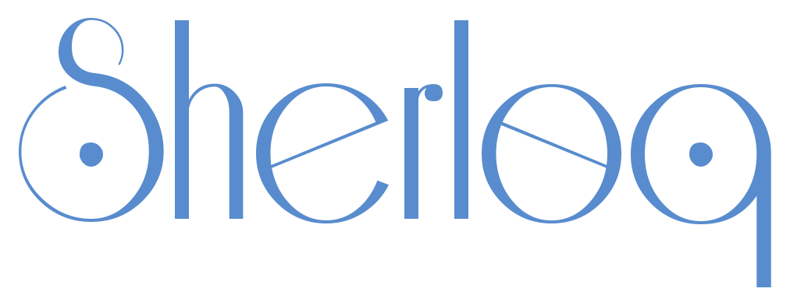
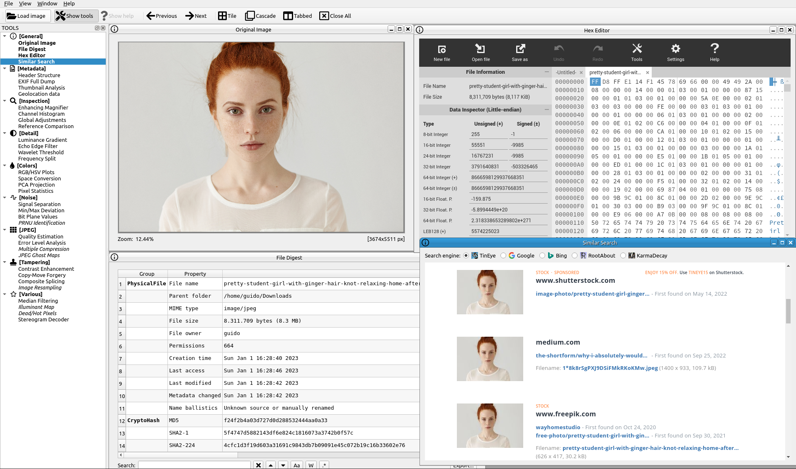
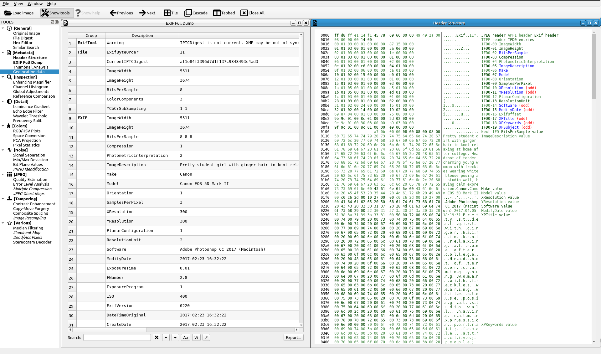
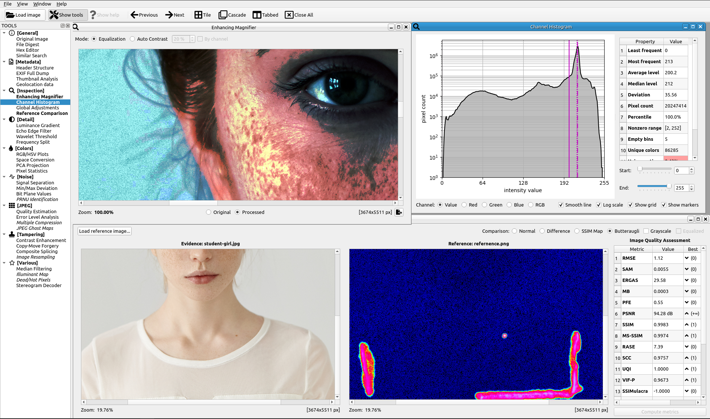
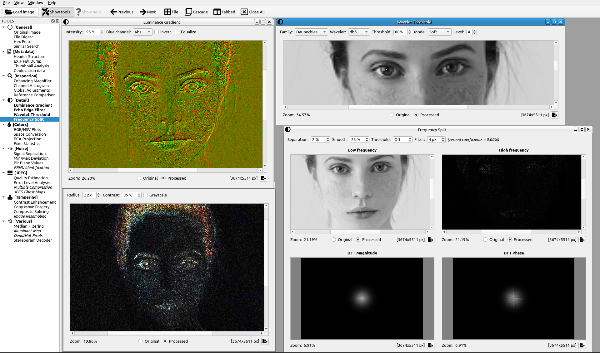
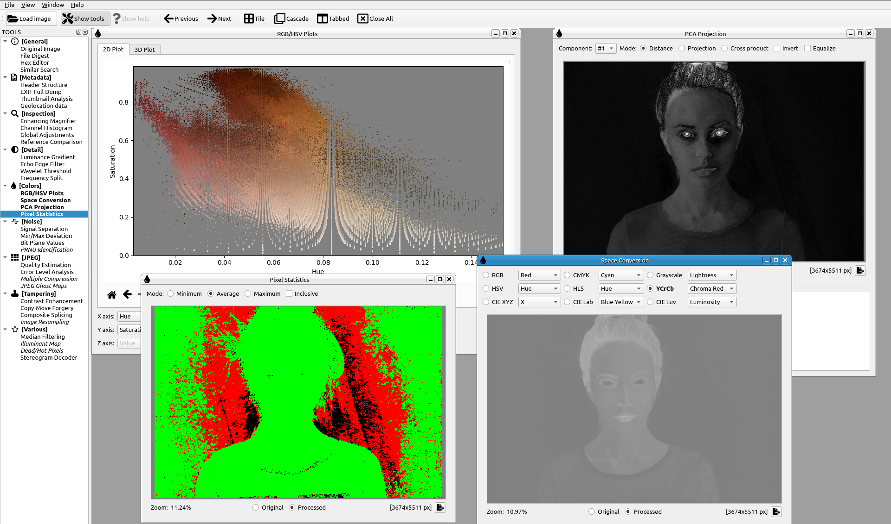
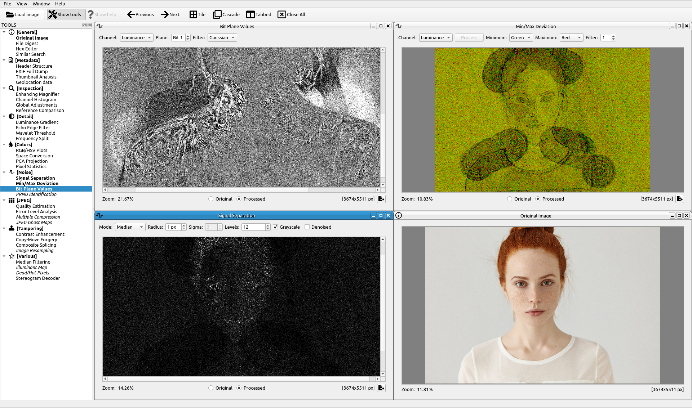
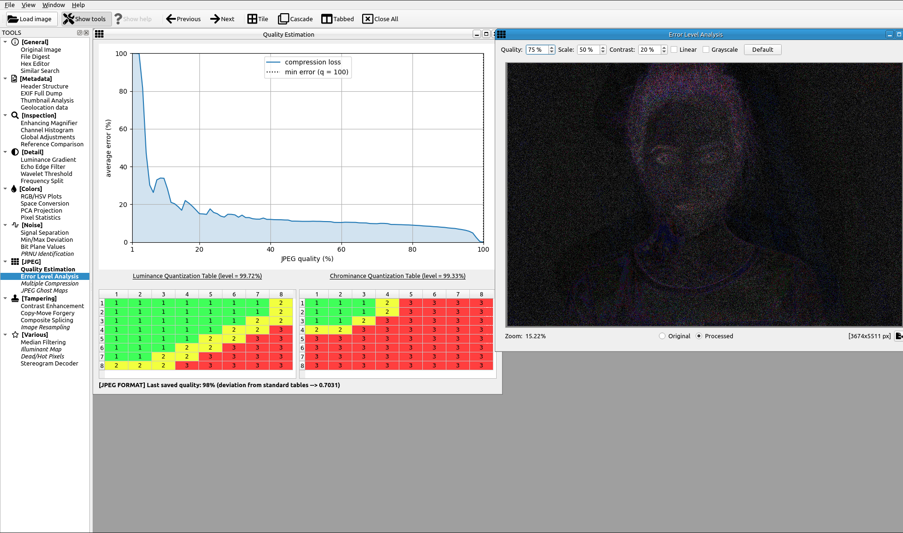
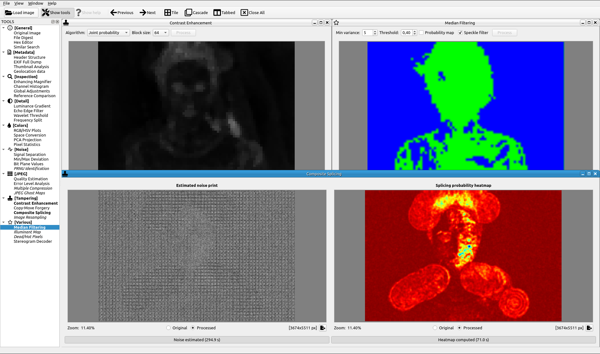

<p align="center">
  
  <br><b>An open source digital image forensic toolset</b>
</p>

# Introduction
"*Forensic Image Analysis is the application of image science and domain expertise to interpret the content of an image and/or the image itself in legal matters. Major subdisciplines of Forensic Image Analysis with law enforcement applications include: Photogrammetry, Photographic Comparison, Content Analysis, and Image Authentication.*" (Scientific Working Group on Imaging Technologies)

**Sherloq** is a personal research project about implementing a fully integrated environment for digital image forensics. It is not meant as an automatic tool that decide if an image is forged or not (that tool probably will never exist...), but as a companion in experimenting with various algorithms found in the latest research papers and workshops.

While many commercial solutions have high retail prices and often reserved to law enforcement and government agencies only, this toolset aims to be a both an extensible framework and a starting point for anyone interested in making experiments in this particular application of digital signal processing.

I strongly believe that *security-by-obscurity* is the wrong way to offer any kind of forensic service (i.e. "Using this proprietary software I guarantee you that this photo *is* pristine... and you have to trust me!"). Following the open-source philosophy, everyone should be able to try various techniques on their own, gain knowledge and share it to the community... even better if they contribute with code improvements! :)

- [History](#history)
- [Features](#features)
- [Screenshots](#screenshots)
- [Installation](#installation)
- [Running with Docker](#running-with-docker)
- [Adding a New Module](#adding-a-new-module)
- [Updates](#updates)
- [Bibliography](#bibliography)

# History
The first version was written in 2015 using C++11 to build a command line utility with many options, but soon it turned to be too cumbersome and not much interactive. That version could be compiled with CMake after installing OpenCV, Boost and AlgLib libraries. This first proof of concept offered about 80% of planned features (see below for the full list).

While also including novel algorithms, the 2017 version mainly added a Qt-based multi-window GUI to provide a better user experience. Multiple analyses could be shown on screen and a fast zoom/scroll  viewer was implemented for easier image navigation. That project could be compiled with Qt Creator with Qt 5 and OpenCV 3 and covered about 70% of planned features.

Fast-forward to 2020 when I decided to port everything in Python (PySide2 + Matplotlib + OpenCV) for easier development and deployment. While this iteration is just begun and I have yet to port all the previous code on the new platform, I think this will be the final "form" of the project (as long as someone does not volunteer up to develop a nice web application!).

I'm happy to share my code and get in contact with anyone interested to improve or test it, but please keep in mind that this repository is *not* intended for distributing a final product, my aim is just to publicly track development of an *unpretentious educational tool*, so expect bugs, unpolished code and missing features! ;)

# Features
This list contains the functions that the toolkit will (hopefully) provide once beta stage is reached (**NOTE:** functions displayed in _italics_ inside the program are not yet implemented!).

## Interface
- Modern Qt-based GUI with multiple tool window management
- Support for many formats (JPEG, PNG, TIFF, BMP, WebP, PGM, PFM, GIF)
- Highly responsive image viewer with real-time pan and zoom
- Many state-of-the-art algorithms to try out interactively
- Export both visual and textual results of the analysis
- Extensive online help with explanations and tutorials

## Tools

### General
- __Original Image__: display the unaltered reference image for visual inspection
- __File Digest__: retrieve physical file information, crypto and perceptual hashes
- __Hex Editor__: open an external hexadecimal editor to show and edit raw bytes
- __Similar Search__: browse online search services to find visually similar images

### Metadata
- __Header Structure__: dump the file header structure and display an interactive view
- __EXIF Full Dump__: scan through file metadata and gather all available information
- __Thumbnail Analysis__: extract optional embedded thumbnail and compare with original
- __Geolocation Data__: retrieve optional geolocation data and show it on a world map

### Inspection
- __Enhancing Magnifier__: magnifying glass with enhancements for better identifying forgeries
- __Channel Histogram__: display single color channels or RGB composite interactive histogram
- __Global Adjustments__: apply standard image adjustments (brightness, hue, saturation, ...)
- __Reference Comparison__: open a synchronized double view for comparison with another picture

### Detail
- __Luminance Gradient__: analyze horizontal/vertical brightness variations across the image
- __Echo Edge Filter__: use derivative filters to reveal artificial out-of-focus regions
- __Wavelet Threshold__: reconstruct image with different wavelet coefficient thresholds
- __Frequency Split__: split image luminance into high and low frequency components

### Colors
- __RGB/HSV Plots__: display interactive 2D and 3D plots of RGB and HSV pixel values
- __Space Conversion__: convert RGB channels into HSV/YCbCr/Lab/Luv/CMYK/Gray spaces
- __PCA Projection__: use color PCA to project pixel onto most salient components
- __Pixel Statistics__: compute minimum/maximum/average RGB values for every pixel

### Noise
- __Noise Separation__: estimate and extract different kind of image noise components
- __Min/Max Deviation__: highlight pixels deviating from block-based min/max statistics
- __Bit Planes Values__: show individual bit planes to find inconsistent noise patterns
- __Wavelet Blocking__: shows averaged noise levels in an image to find noise inconsistencies
- __PRNU Identification__: exploit sensor pattern noise introduced by different cameras

### JPEG
- __Quality Estimation__: extract quantization tables and estimate last saved JPEG quality
- __Error Level Analysis__: show pixel-level difference against fixed compression levels
- __Multiple Compression__: use a machine learning model to detect multiple compression
- __JPEG Ghost Maps__: highlight traces of different compression levels in difference images

### Tampering
- __Contrast Enhancement__: analyze color distribution to detect contrast enhancements
- __Copy-Move Forgery__: use invariant feature descriptors for cloned area detection
- __Composite Splicing__: exploit DCT statistics for automatic splicing zone detection
- __Image Resampling__: estimate 2D pixel interpolation for detecting resampling traces


### Various
- __Median Filtering__: detect processing traces left by nonlinear median filtering
- __Illuminant Map__: estimate scene local light direction on estimated 3D surfaces
- __Dead/Hot Pixels__: detect and fix dead/hot pixels caused by sensor imperfections
- __Stereogram Decoder__: decode 3D images concealed in crossed-eye autostereograms


# Screenshots
<p align="center">
  
  <br><b>General</b>: Original Image, Hex Editor, File Digest, Similar Search
</p>

<p align="center">
  
  <br><b>Metadata</b>: EXIF Full Dump, Header Structure
</p>

<p align="center">
  
  <br><b>Inspection</b>: Enhancing Magnifier, Channel Histogram, Reference Comparison
</p>

<p align="center">
  
  <br><b>Detail</b>: Luminance Gradient, Echo Edge Filter, Wavelet Threshold, Frequency Split
</p>

<p align="center">
  
  <br><b>Colors</b>: RGB/HSV Plots, Space Conversion, PCA Projection, Pixel Statistics 
</p>

<p align="center">
  
  <br><b>Noise</b>: Signal Separation, Min/Max Deviation, Bit Plane Values
</p>

<p align="center">
  
  <br><b>JPEG</b>: Quality Estimation, Error Level Analysis 
</p>

<p align="center">
  
  <br><b>Tampering</b>: Contrast Enhancement, Copy/Move Forgery, Composite Splicing, Median Filtering
</p>

# Installation

## [1/4] Download source code

Clone the current repository into a local folder and change current directory to it.

## [2/4] Virtual environment

For more information about Python Virtual Environments, you can read [here](https://realpython.com/python-virtual-environments-a-primer/) or [here](https://chriswarrick.com/blog/2018/09/04/python-virtual-environments/).
Choose one of the following method to create a new virtual environment with Python 3.11 for Sherloq.

### [Built-in Virtual Environment](https://docs.python.org/3/library/venv.html)
Change current directory to Sherloq root, then initialize virtual environment folder:
```console
$ python -m venv .venv
```
Then activate it:
#### Linux
```console
$ source .venv/bin/activate
```

#### Windows
```console
C:\> .venv\Scripts\activate.bat
```

### [VirtualEnvWrapper](https://virtualenvwrapper.readthedocs.io/en/latest/)

#### Linux
```console
$ sudo apt install python3-distutils python3-dev python3-testresources subversion
$ wget https://bootstrap.pypa.io/get-pip.py
$ sudo python3 get-pip.py
$ rm get-pip.py
$ sudo pip install virtualenv virtualenvwrapper
$ echo -e "\n# Python Virtual Environments" >> ~/.bashrc
$ echo "export WORKON_HOME=$HOME/.virtualenvs" >> ~/.bashrc
$ echo "export VIRTUALENVWRAPPER_PYTHON=/usr/bin/python3" >> ~/.bashrc
$ echo "source /usr/local/bin/virtualenvwrapper.sh" >> ~/.bashrc
$ source ~/.bashrc
$ mkvirtualenv sq -p python3
```
#### Windows
1. Download *Python 3.11* setup package from [official site](https://www.python.org/downloads/)
2. Install ensuring that "Add Python to PATH" and "PIP installation" are enabled
3. Open *Command Prompt* and enter the following commands:
```console
> pip install virtualenv virtualenvwrapper-win
> mkvirtualenv sq
```
### [Conda environment](https://conda.io/projects/conda/en/latest/user-guide/tasks/manage-environments.html)
1. Install latest **Miniconda** following instructions from the [official site](https://docs.conda.io/projects/miniconda/en/latest/miniconda-install.html)
2. Create a new **virtual environment**: `conda create --name sq python=3.11 -y`
3. **Activate** the `sq` environment: `conda activate sq`

## [3/4] Install dependencies

```console
cd gui
pip install -r requirements.txt
```

## [4/4] Launch program
```console
python sherloq.py
```

NOTE for Linux users: if this error is displayed:
```
qt.qpa.plugin: From 6.5.0, xcb-cursor0 or libxcb-cursor0 is needed to load the Qt xcb platform plugin.
qt.qpa.plugin: Could not load the Qt platform plugin "xcb" in "" even though it was found.
This application failed to start because no Qt platform plugin could be initialized. Reinstalling the application may fix this problem.
```
Run this command from the terminal: `sudo apt install -y libxcb-cursor-dev` 

# Running with Docker

Docker lets you run Sherloq without setting up a Python environment locally. Because Sherloq has a GUI, you need an X server on your host to forward the display.

## Prerequisites

- [Docker](https://docs.docker.com/get-docker/) installed and running
- [VcXsrv / XLaunch](https://sourceforge.net/projects/vcxsrv/) (Windows) or an X server of your choice

## [1/4] Start XLaunch

Launch **XLaunch** and click **Next** through the wizard until you reach the **Extra Settings** page. Check **"Disable access control"**, then finish the wizard.

## [2/4] Build the image

From the repository root (where the `Dockerfile` lives), run:

```console
docker build -t sherloq-app .
```

## [3/4] Run the container

Replace `path\to\test-pictures` with the folder on your machine that contains the images you want to analyze:

```console
docker run -it --rm \
  -e DISPLAY=host.docker.internal:0.0 \
  -v "path\to\test-pictures:/dataset" \
  sherloq-app
```

> **Windows CMD / PowerShell note:** use a single line without the backslash continuation:
> ```console
> docker run -it --rm -e DISPLAY=host.docker.internal:0.0 -v "path\to\test-pictures:/dataset" sherloq-app
> ```

## [4/4] Use Sherloq

Sherloq will open in a window forwarded through XLaunch. Images mounted under `/dataset` inside the container are accessible via **File → Load image**.

## Troubleshooting: `host.docker.internal` not working

On some Windows setups `host.docker.internal` does not resolve correctly inside the container. Use your machine's local IPv4 address instead.

1. Open **CMD** and run `ipconfig`. Look for the **IPv4 Address** under your active network adapter (e.g., `192.168.67.67`).
2. Re-run the container substituting that address for the `DISPLAY` value:

```console
docker run -it --rm -e DISPLAY=192.168.67.67:0.0 -v "C:\path\to\test-pictures:/dataset" sherloq-app
```

Make sure XLaunch is still running with **"Disable access control"** checked, otherwise the container will be blocked from connecting to the X server.

# Adding a New Module

All analysis tools follow the same three-step integration pattern: create a widget file, register it in the tool tree, then wire it up in the main window.

## Step 1 Create the widget file

Create a new Python file in `gui/` (e.g., `gui/mymodule.py`). Your main class must extend `ToolWidget` from `tools.py`, which provides the `info_message` signal used to send status text to the status bar.

```python
# gui/mymodule.py
import cv2 as cv
from PySide6.QtWidgets import QVBoxLayout, QLabel
from tools import ToolWidget

class MyModuleWidget(ToolWidget):
    def __init__(self, image, parent=None):
        super().__init__(parent)
        # store the image and build your UI here
        self.image = image
        layout = QVBoxLayout()
        layout.addWidget(QLabel("My analysis result"))
        self.setLayout(layout)
        self.info_message.emit("My Module loaded")
```

`ToolWidget` already declares `info_message = Signal(str)`, so emit it whenever you want text shown in the status bar. If your tool also needs the file path (e.g., to read metadata), accept it as an extra argument like most modules in `gui/` do (e.g., `DigestWidget(self.filename, self.image)`).

## Step 2 Register the tool in `tools.py`

Open `gui/tools.py`. Tools are organized into numbered groups (`[0]` General, `[1]` Metadata, `[2]` Inspection, etc.). Find the group that fits your tool, or append a new group at the end.

Inside the chosen group block, add your tool's **name**, **description**, and **progress** value:

| Progress value | Meaning |
|---|---|
| `0` | Not yet implemented (shown in *italic* in the tree) |
| `1` | In debug |
| `2` | Working but incomplete |
| `3` | Complete |

```python
# Example: adding to group [9] Various
group_names.append(self.tr("[Various]"))
tool_names.append([
    self.tr("Median Filtering"),
    self.tr("Illuminant Map"),
    self.tr("Dead/Hot Pixels"),
    self.tr("Stereogram Decoder"),
    self.tr("My Module"),          # <-- add here
])
tool_infos.append([
    self.tr("Detect nonlinear processing traces left by median filtering"),
    self.tr("Estimate scene local light direction on estimated 3D surfaces"),
    self.tr("Detect and fix dead/hot pixels caused by sensor imperfections"),
    self.tr("Decode 3D images concealed inside crossed-eye autostereograms"),
    self.tr("Short description of what My Module does"),  # <-- and here
])
tool_progress.extend([2, 0, 0, 3, 2])  # <-- append progress for your tool
```

The position of your entry in the list determines its **tool index** (`j`) — the index used in Step 3.

## Step 3 Wire up the widget in `sherloq.py`

Open `gui/sherloq.py` and make two changes.

**3a. Import your widget** at the top alongside the other imports:

```python
from mymodule import MyModuleWidget
```

**3b. Add a branch in `open_tool()`** inside the `elif group == N:` block that corresponds to the group number you chose in Step 2. Use the tool's list index (`j`) as the condition:

```python
elif group == 9:
    if tool == 0:
        tool_widget = MedianWidget(self.image)
    elif tool == 3:
        tool_widget = StereoWidget(self.image)
    elif tool == 4:                                     # <-- new branch
        tool_widget = MyModuleWidget(self.image)        #     (index matches position in tools.py)
    else:
        return
```

If you added a **new group** instead of extending an existing one, add a matching `elif group == N:` block after the last existing group block.

After these three changes, rebuild and run, your tool will appear in the sidebar tree and open as an MDI sub-window when double-clicked.

```console
cd gui
python sherloq.py
```

# Updates
When a new version is released, update the local working copy using Git, SVN or manually downloading from this repository and (if necessary) update the packages in the virtual environment following [this guide](https://www.activestate.com/resources/quick-reads/how-to-update-all-python-packages/).

# Recommended Resources for Getting Started
- Paper with practical examples and thoughtful analysis for techniques that have since been implemented in Sherloq: "A Picture's Worth: Digital Image Analysis and Forensics" ([Neal Krawetz](https://www.hackerfactor.com/)) [[paper](http://blackhat.com/presentations/bh-dc-08/Krawetz/Whitepaper/bh-dc-08-krawetz-WP.pdf)]
- Thesis with practical examples and thoughtful analysis for using the "JPEG Ghosts", "Image Resampling" and "Noise Wavelet Blocking" tools implemented in Sherloq. This work also offers insights towards the use and reliability of AI driven approaches in Digital Image Forensics. ([UHstudent](https://github.com/UHstudent)) [[paper](https://github.com/UHstudent/digital_image_forensics_thesis/blob/main/Thesis%20text_Digital%20Image%20Forensics-A%20Comparative%20Study%20between%20AI%20and%20traditional%20approaches.pdf)]

# References for Algorithms Implemented in Sherloq
- Image Resampling: "Exposing Digital Forgeries by Detecting Traces of Re-sampling" (Alin C. Popescu and Hany Farid) [[paper](https://farid.berkeley.edu/downloads/publications/sp05.pdf)]
- JPEG Ghosts: "Exposing Digital Forgeries from JPEG Ghosts" (H. Farid) [[paper](https://farid.berkeley.edu/downloads/publications/tifs09.pdf)]
- Noise Wavelet Blocking: "Using noise inconsistencies for blind image forensics" (Babak Mahdian and Stanislav Saic) [[paper](https://www.utia.cas.cz/files/Soutez_09/Saic/Mahdian%20Saic%20_2009_Image-and-Vision-Computingfinal%20final%20version%20.pdf)]


# Bibliography
- "Noiseprint: a CNN-based camera model fingerprint" (Davide Cozzolino, Luisa Verdoliva) [[website](http://www.grip.unina.it/research/83-multimedia_forensics/107-noiseprint.html)]
- "Two Improved Forensic Methods of Detecting Contrast Enhancement in Digital Images" (Xufeng Lin, Xingjie Wei and Chang-Tsun Li) [[paper](https://d1wqtxts1xzle7.cloudfront.net/45863267/Two_Improved_Forensic_Methods_of_Detecti20160522-6998-1xf1cu.pdf?1463954131=&response-content-disposition=inline%3B+filename%3DTwo_improved_forensic_methods_of_detecti.pdf&Expires=1598306603&Signature=dYuKum8UF2NJS~2Jz2pFObtzdjKfYIcYD4GksLVNN0izhm2k10TVPV~UHKS0DbMLXKaurZPq7uvG~qQwQwwF4JKbY0zoCqZI-p9KZsEMYhlRJrYM8nNQL0V7sHMTLd3aYjNLWup~-i1RzJcJdRqzjU9doGxRJvHdsX6tbwIxNRq3JiYyldaXei4xJSJAbX7EoUOut2uh~jsPnsAbDOIrYpwUhebut-XsN2c5MXargD2UhKxZ3Ifwo4hJvz8Bl2sPys~E8P6vDlqOeEHoeByZms6JQON97EGsCTT5GYF98rQLDbqj0NroYE2zDMGcu9IUp8VV1Fotqci1G6eELTXx6w__&Key-Pair-Id=APKAJLOHF5GGSLRBV4ZA)]
